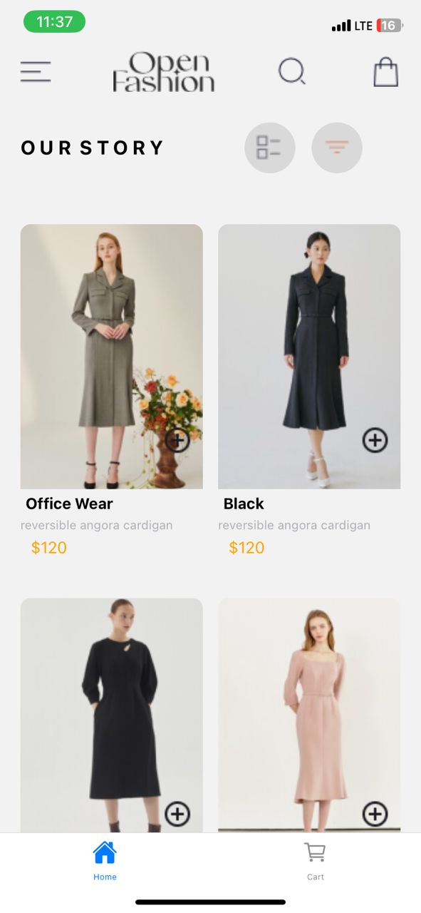
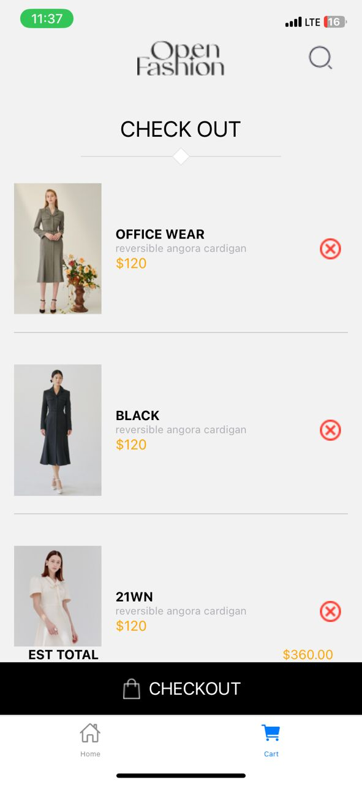

# Assignment6
# 11300128
## Home Page
The homepage component of this React Native application serves as a default interface for exploring and selecting products. It enables customers to see numerous clothing goods, including their specifications, and add them to their shopping basket.
### Product Display
- **Grid Layout:** Products are shown in a responsive grid style with flexwrap to guarantee they adjust to various screen sizes.
- **Product Cards:** Each product is displayed in a card-like design that clearly shows the image, name, description, and price.
## Implementation of Data Storage
- **AsyncStorage:** 
- **Stores** user's cart data locally on the device.
- **Updates** the cart with new products using AsyncStorage, ensuring persistence across app sessions for a seamless shopping experience.

# Screenshots
[text](README.md)  
